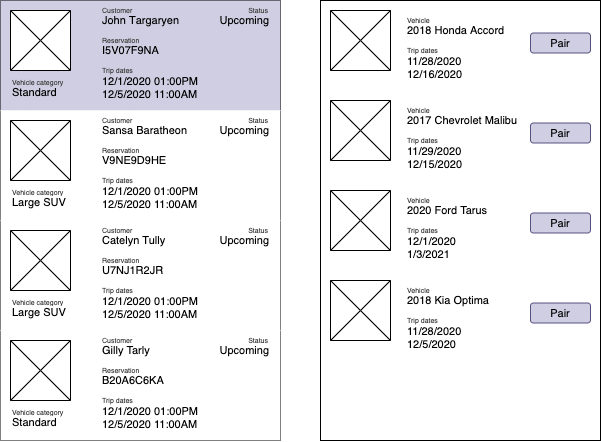

Avail Frontend Take Home
========================

This is a take home assignment we give to interview candidates. It's intended to be open ended in
terms of technology. We have included some mock apis (located in the `src/api` directory of this
repo). These apis load data from static json files, however, they still return the values via
a Javascript Promise as to simulate a call to a backend.

Additionally we have included a wire-frame (see `pair-booking-wire-frame` in this repo) to provide
visual direction.

Background
----------

Avail uses a vehicle category when a customer creates a booking on our website. Using a vehicle
category versus the actual vehicle removes complexity for the customer. Internally we use
vehicle category to help with inventory management.

Listings are vehicles that have been shared by their owners for sharing on the Avail platform.

When bookings come into our system a lot administrator will eventually pair a booking with an
actual listing. Lot administrators work at our physical locations and are responsible many things.
One of those responsibilities is ensuring that bookings are satisfied and proper inventory is
always reflected on our website.

Story
-----

As a Lot Administrator, I would like to pair a booking with an actual vehicle, so that I better
understand my inventory and update my capacities on our website.

Assignment
----------

Build an application using any web browser based framework you feel the most comfortable with that
allows a Lot Administrator to pair "upcoming" bookings with "current" listings.

The following are some acceptance criteria:

- Only Bookings with the "status" of "upcoming" should be available for pairing
- Only compatible listings can be paired with a booking:
  - Category between the booking and listing must match
  - Listing must be in the "current" status
  - Listing duration must satisfy the entire booking duration
    - Listing `startDate` must be less than the booking `startDate`
    - Listing `endDate` must be greater than the booking `endDate`
